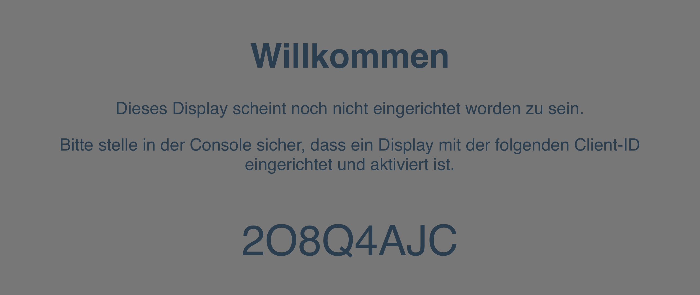

Um die Alarmanzeige auf einen Monitor zu bringen, wird ein Gerät mit einem Webbrowser benötigt.
Das kann ein vollwertiger PC, aber auch ein Kleinstrechner wie ein Raspberry Pi oder ein Tablet sein.

## Webanwendung laden
Die Anzeige wird vom Server unter dem Pfad `/display` bereitgestellt.
Wenn der Server der Alarmanzeige unter der IP-Adresse _192.168.1.5_ auf Port 3000 läuft, ist die Anzeige unter `http://192.168.1.5:3000/display` erreichbar.

Diese URL wird in den Browser eingegeben, um die Anzeige zu laden.

## Display freischalten
Damit die Daten der Alarmanzeige nicht abgegriffen werden können, ist es erforderlich, dass sich das Display am Server anmeldet.
Über die oben genannte URL kann zwar die Webanwendung geladen werden, dem Display werden aber nur dann Daten übermittelt, wenn es freigeschaltet wurde.

Beim ersten Aufruf zeigt das Display eine 8-stellige ID an.

In der [Console](05_Console.md) muss nun ein neues Display angelegt werden.
Es sollte ein Name mit Wiedererkennungswert vergeben werden, vor allem wenn es mehrere Displays gibt.
Als _Client-ID_ wird die auf dem Willkommensbildschirm angezeigte ID eingegeben.

Sobald das neue Display erfolgreich gespeichert wurde, schaltet es sich in den Ruhemodus und zeigt Datum und Uhrzeit an.
Jetzt kann damit begonnen werden, [die Ansichten einzurichten](15_Ansichten_einrichten.md).

## Hinweise
Dieser Prozess ist nur eine vorläufige Maßnahme zur Zugriffsbeschränkung und wird sich in Zukunft noch ändern.

Um den Platz optimal zu nutzen, empfiehlt es sich, den Browser im Vollbildmodus zu betreiben.
Auch sollte sichergestellt werden, dass nach einem Neustart des Anzeigegeräts der Browser mit der oben genannten URL startet.