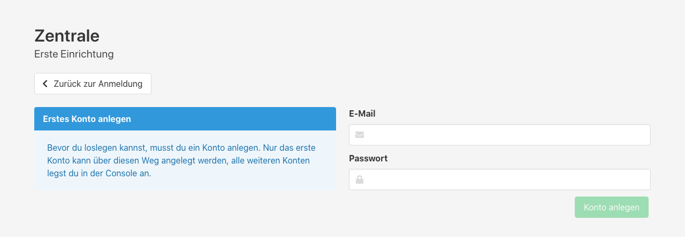
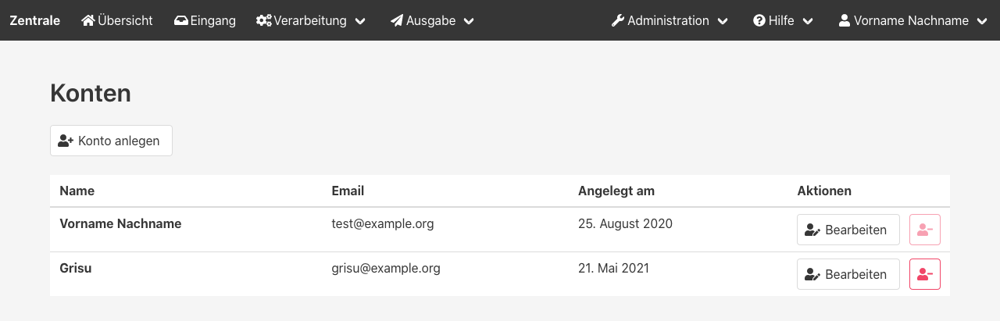

Die Console ist die Verwaltungsoberfläche für die Zentrale.
Hier können die Alarmquellen verwaltet und die weitere Verarbeitung der Alarme festgelegt werden.

## Aufrufen der Console
Die Console wird vom Server unter dem Pfad `/console` bereitgestellt.
Wenn der Server der Zentrale unter der IP-Adresse _192.168.1.5_ auf Port 4711 läuft, ist dessen Console unter `http://192.168.1.5:4711/console` erreichbar.

## Der erste Login
Bevor du dich das erste Mal einloggen kannst, musst du ein Benutzerkonto anlegen.
Das geht direkt über den Knopf "Konto anlegen" neben dem Login-Formular.

## Benutzerverwaltung

Unter _Administration > Konten_ können alle weiteren Benutzerkonten verwaltet werden.
Alle Konten haben die gleichen Rechte.

