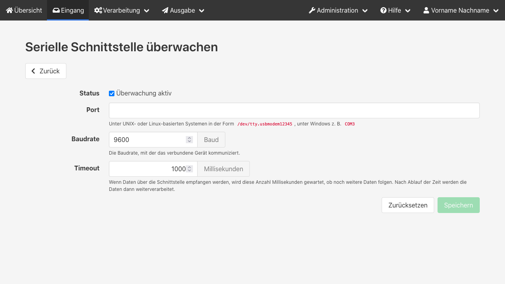

Der Empfang von Einsatzdaten über eine serielle Schnittstelle wird beispielsweise benötigt, um einen Digitalen Meldeempfänger (DME) als Alarmquelle zu nutzen.
Es können mehrere serielle Schnittstellen gleichzeitig überwacht und individuell ausgewertet werden.

## Serielle Schnittstelle hinzufügen
Klicke auf den Reiter _Eingang_ und wähle dann unter _Quelle hinzufügen_ den Punkt _Serielle Schnittstelle_ aus.

Die voreingestellte Baudrate von 9600 sollte in den meisten Fällen passen.
Falls es nicht funktioniert, müsstest du in der Anleitung zum Gerät eine Angabe finden.
Du kannst es auch auf gut Glück mit anderen typischen Baudraten versuchen.

Der Timeout bewirkt, dass nach dem Empfang von Daten noch eine kurze Zeit gewartet wird, ob weitere Daten folgen.
Der Standardwert von einer Sekunde ist recht großzügig bemessen und kann bei Bedarf angepasst werden.

Die Überwachung beginnt automatisch mit dem Starten des Servers, sofern der Status auf aktiv gesetzt ist.
Über den Haken _Überwachung aktiv_ kannst du den Zustand auch im laufenden Betrieb ändern.
Beim Beenden des Servers werden alle noch geöffneten Ports geschlossen.

Nach dem Speichern kannst du noch ein Layout zur Textanalyse auswählen, mit dem die eingehenden Alarme zerlegt werden.
Wenn für deine Leitstelle noch kein Layout hinterlegt ist, melde dich bitte im [Forum](https://community.alarmdisplay.org/c/funktionalitaet/alarmquellen/9).
