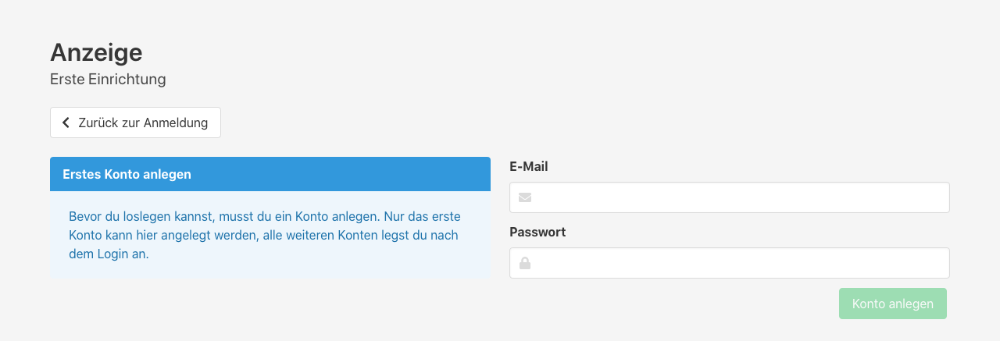
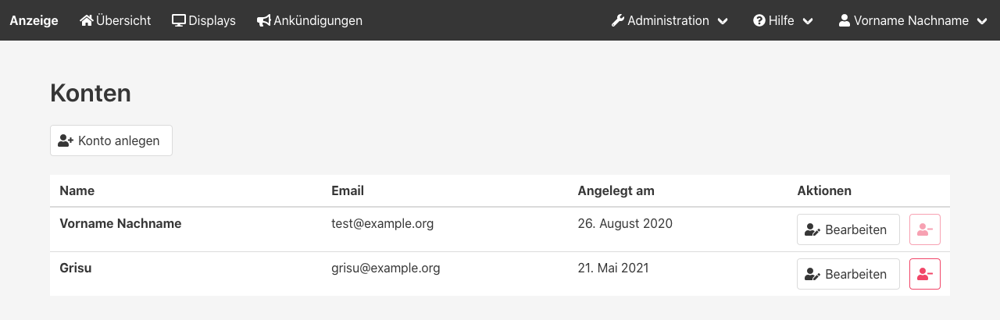
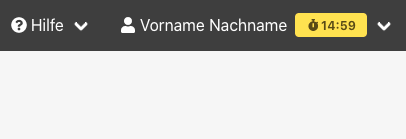

Die Console ist die Verwaltungsoberfläche für die Anzeige.
Hier können Displays und deren Aussehen verwaltet werden.
Ebenso werden hier Inhalte (z.B. Ankündigungen) gepflegt.

## Aufrufen der Console
Die Console wird vom Server unter dem Pfad `/console` bereitgestellt.
Wenn der Server der Anzeige unter der IP-Adresse _192.168.1.5_ auf Port 4711 läuft, ist dessen Console unter `http://192.168.1.5:4711/console` erreichbar.

## Der erste Login
Bevor du dich das erste Mal einloggen kannst, musst du ein Benutzerkonto anlegen.
Das geht direkt über den Knopf "Konto anlegen" neben dem Login-Formular.

## Benutzerverwaltung

Unter _Administration > Konten_ können alle weiteren Benutzerkonten verwaltet werden.
Alle Konten haben die gleichen Rechte.

## Sitzungsdauer
Eine Sitzung ist für einen vorgegebenen Zeitraum ab der Anmeldung gültig.
Nach Ablauf dieser Zeit wirst du automatisch abgemeldet.
In den 15 Minuten zuvor bekommst du eine kleine Vorwarnung, damit du nicht davon überrascht wirst.
Du kannst dich auch selbst ab- und wieder anmelden, um die Sitzung sofort zu verlängern.

Normalerweise ist eine Sitzung für 24 Stunden gültig, du kannst die Zeit über die [Konfiguration](02_Konfiguration#page_Sitzungsdauer_der_Console_anpassen) anpassen.
