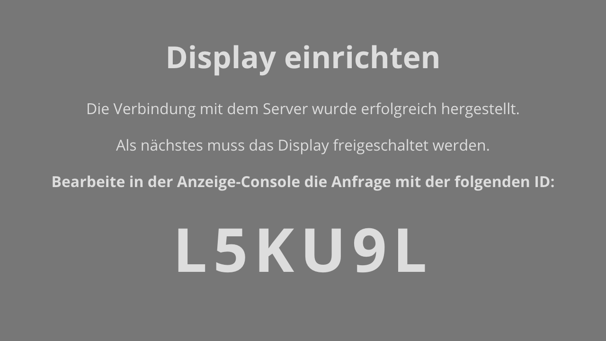
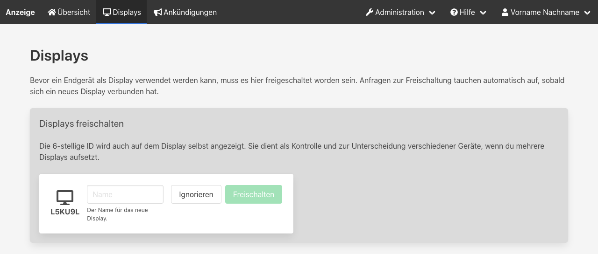

Um die Alarmanzeige auf einen Monitor zu bringen, wird ein Gerät mit einem Webbrowser benötigt.
Das kann ein vollwertiger PC, aber auch ein Kleinstrechner wie ein Raspberry Pi oder ein Tablet sein.

## Webanwendung laden
Die Anzeige wird vom Server unter dem Pfad `/display` bereitgestellt.
Wenn der Server der Alarmanzeige unter der IP-Adresse _192.168.1.5_ auf Port 4711 läuft, ist die Anzeige unter `http://192.168.1.5:4711/display` erreichbar.

Gib diese URL in den Browser ein, um die Anzeige zu laden.

## Display freischalten
Über die oben genannte URL kann zwar die Webanwendung geladen werden, dem Display werden aber nur dann Daten übermittelt, wenn es freigeschaltet wurde.
Das soll verhindern, dass Daten von Unbefugten abgegriffen werden.

Beim ersten Aufruf zeigt das Display eine 6-stellige ID an.

In der [Console](05_Console.md) findest du nun unter _Displays_ eine Anfrage mit der gleichen ID.
Das dient einerseits der Kontrolle, aber auch der Unterscheidung, wenn du mehrere Displays gleichzeitig einrichtest.
Vergib nun einen eindeutigen Namen für das Display und klicke auf _Freischalten_.

Sobald sich das neue Display erfolgreich anmelden konnte, schaltet es sich in den Ruhemodus und zeigt Datum und Uhrzeit an.
Jetzt kann damit begonnen werden, [die Ansichten einzurichten](15_Ansichten_einrichten.md).

## Hinweise
Um den Platz optimal zu nutzen, empfiehlt es sich, den Browser im Vollbildmodus zu betreiben.
Auch sollte sichergestellt werden, dass nach einem Neustart des Anzeigegeräts der Browser mit der oben genannten URL startet.
