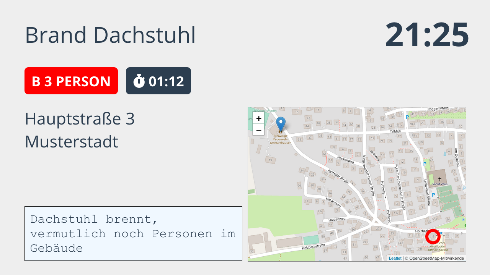

Die Ansichten für ein Display können in der [Console](05_Console.md) verwaltet werden.
Dazu in der Übersicht der Displays den Knopf 'Ansichten' des betreffenden Displays wählen.

## Ruhemodus
Wenn das Display frisch eingerichtet wurde, ist noch keine Ansicht für den Ruhemodus vorhanden.
In diesem Fall zeigt das Display einfach das aktuelle Datum und die Uhrzeit mittig an.
Falls dies ausreicht, muss nichts weiter eingestellt werden.

Um den Ruhemodus informativer zu gestalten, stehen eine Reihe von Komponenten zur Verfügung.
Dazu zählen neben Datum/Uhrzeit noch _Ankündigungen_ zur Auflistung von Neuigkeiten und Unwetterkarten des DWD.
Weitere Komponenten sind in Planung, Ideen können gerne in der [Community](https://community.alarmdisplay.org/c/funktionalitaet/alarmanzeige/8) eingebracht werden.

Um die Komponenten zu verwenden, muss erst mit dem Knopf _Ansicht hinzufügen_ eine leere Ansicht angelegt werden.
Es können auch mehrere Ansichten angelegt werden, diese werden dann im Wechsel angezeigt.

Beim Bearbeiten einer Ansicht können die Komponenten auf einem Raster frei angeordnet werden.
Die Dimensionen des Rasters (Spalten und Zeilen) können für jede Ansicht separat eingestellt werden.

Bei den Komponenten _Ankündigungen_ und _DWD-Unwetterkarte_ kann durch einen Klick auf den Namen der Komponente ein Fenster mit Optionen geöffnet werden.

## Alarmbildschirm
Im Moment kann das Aussehen des Alarmbildschirms nicht individuell angepasst werden.
Der standardmäßige Alarmbildschirm versucht, die vorhandenen Informationen möglichst klar darzustellen.

Enthalten sind:
- Einsatzgrund
- Stichwort
- Verstrichene Zeit
- Adresse
- Karte des Einsatzortes
- Freitext
- Aktuelle Uhrzeit

Die Karte wird angezeigt, sobald Koordinaten in den Einsatzdaten enthalten sind.
In der Console kann unter _Einstellungen_ die Position der Wache eingetragen werden, um diese mit auf der Karte anzuzeigen.

Wenn das Display als Tablet konfiguriert ist, wird anstelle der Karte ein Knopf angezeigt, mit dem die Koordinaten in eine Navigations- oder Karten-App übernommen werden können.
