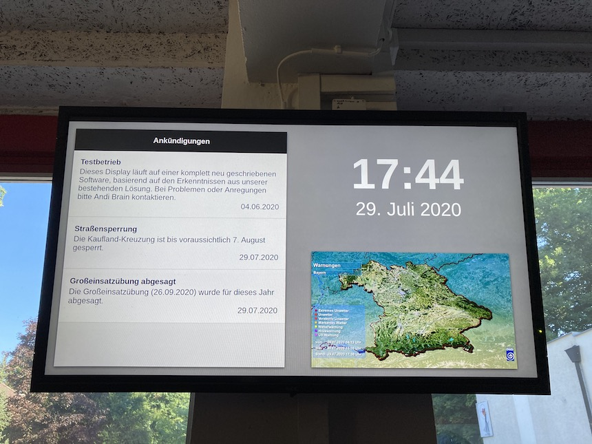
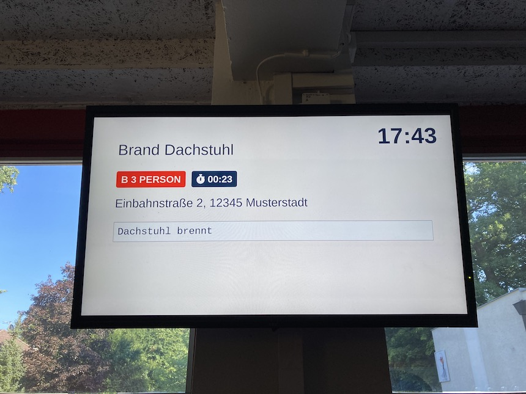

Die Anzeige setzt sich aus einem Server und einem oder mehreren Displays zusammen.
Für eine benutzerfreundliche Einrichtung und Verwaltung stellt der Server die [Console](05_Console.md) zur Verfügung.

## Features

- Web-App für Anzeigegeräte
    - Ruhemodus mit Uhrzeit/Datum, Ankündigungen und DWD-Unwetterkarten
    - Alarmbildschirm mit Einsatzgrund, Stichwort, Zeit seit dem Alarmeingang, Zieladresse und Freitext der Leitstelle
- Web-App zur Verwaltung aller Einstellungen im Browser
    - Schneller Einrichtungsprozess für neue Displays
    - Drag-and-drop-Konfiguration von Anzeige-Layouts
    - Nutzeraccounts (derzeit alle mit der gleichen Berechtigung)
- REST-API und WebSocket-Verbindung für eigene Software
    - Authentifizierung mit JWT und statischen API-Keys

## Bilder

So kann die Anzeige in der Praxis aussehen.
Das Layout und der Inhalt des Ruhebildschirms können individuell angepasst werden.

